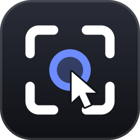
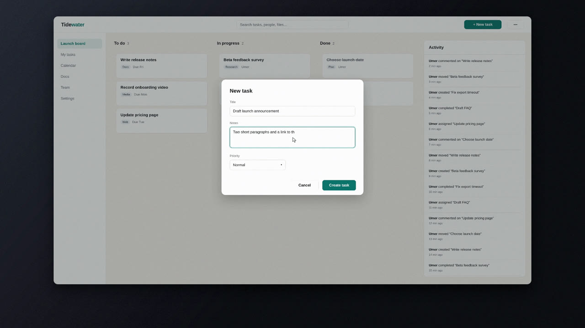
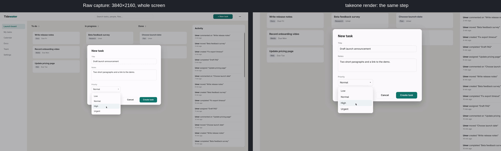
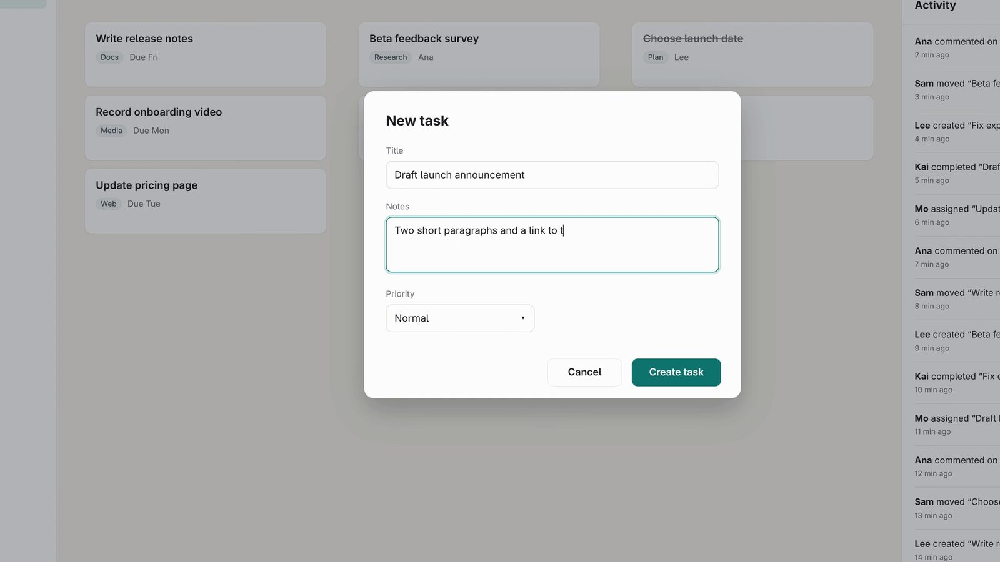
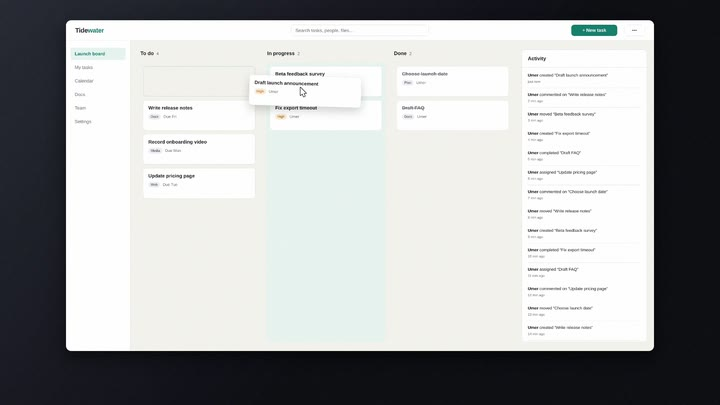
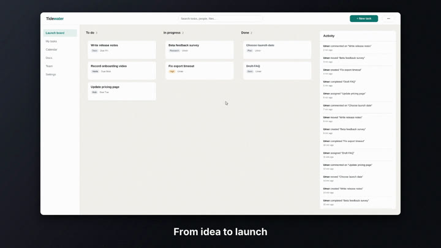
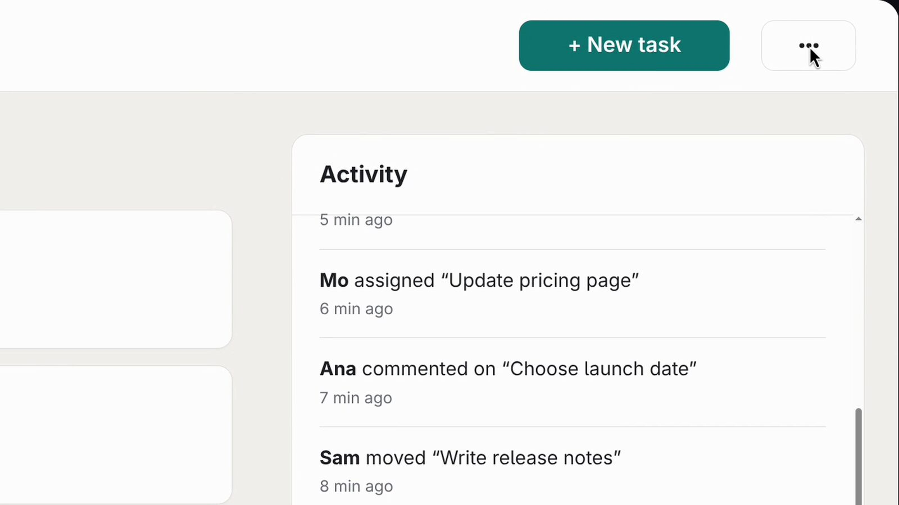
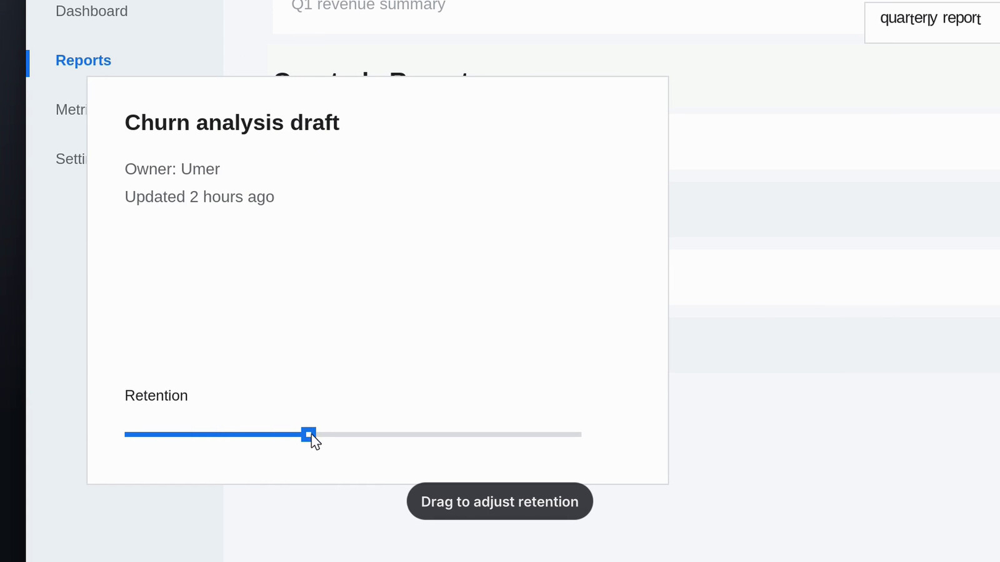
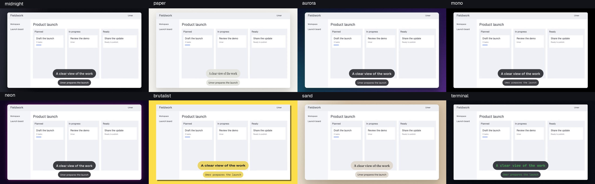

<h1 align="center">
   takeone
</h1>

<p align="center">
  <a href="https://github.com/umeranjum17/takeone/actions/workflows/ci.yml"></a>
</p>

<p align="center">
  <strong>Record once. Direct the camera afterwards.</strong><br/>
  takeone is a private screen-recording studio that turns a raw capture into a polished demo. You demonstrate your app the way you normally use it; takeone then plans every zoom, hold and pan from what actually happened on screen, and renders a framed, paced MP4 locally.
</p>

<p align="center">
  <picture><source srcset="docs/assets/readme/hero.webp" type="image/webp"></picture>
</p>

## Why takeone exists

A good product demo needs camera work: push in on the control you click, hold the dialog you type into, pull back when the result lands. Doing that while you demonstrate means performing and directing at the same time, and a full-screen 4K capture is unreadable on a phone or in a feed.

takeone splits the two jobs. Recording is only recording. Camera work is planned after the take, from the input events and screen changes it logged, at a bounded, measured cost of about $0.0006 per minute of video. Rendering is local ffmpeg work and costs nothing.

## See it in action

Every capture below is real takeone output: stills from a 69.3 s take of a staged, fictional project board, recorded on an empty Hyprland workspace, and one synthetic take rendered with the current code. Every person shown is Umer. Nothing is mocked.

### Plan the camera after you record

The recorder keeps the whole 3840×2160 screen and the input events. `make` picks what matters at each moment and frames it, so the Priority dropdown that is a few pixels tall in the raw capture fills the shot in the render.

<p align="center">
  <picture><source srcset="docs/assets/readme/before-after.webp" type="image/webp"></picture>
</p>

### Hold the whole panel

When a click opens a panel or dialog, the shot holds all of it. While you type, the camera keeps the whole form in frame (title, notes, priority and buttons) instead of chasing the caret.
When a dialog closes, takeone detects the revealed result and frames the changed area, so viewers can see the new card or toast.

<p align="center">
  <picture><source srcset="docs/assets/readme/typing.webp" type="image/webp"></picture>
</p>

### Every click shows

Each click and drag press gets a press dot and an expanding accent ring with a white halo. The ring is drawn in source space, so it zooms with the content.

<p align="center">
  <picture><source srcset="docs/assets/readme/drag.webp" type="image/webp"></picture>
</p>

### A stage, not a screenshot

At rest the screen sits as a rounded card with a soft shadow on a gradient. The margin eases away as the camera zooms, so close-ups are all screen, and the video fades in and out on the stage colour.

<p align="center">
  <picture><source srcset="docs/assets/readme/stage.webp" type="image/webp"></picture>
</p>

### Close-ups that stay crisp

Zoom never upscales source pixels more than 1.5×, and the camera path runs through a critically damped spring, so moves ease in and out without overshoot or jitter.

<p align="center">
  <picture><source srcset="docs/assets/readme/close-up.webp" type="image/webp"></picture>
</p>

### Titles and captions

Add a `title` and timed `captions` to `take.json` and they render as rounded pills near the bottom. Caption times are source-video seconds, and reading time survives idle squeezing.

<p align="center">
  <picture><source srcset="docs/assets/readme/captions.webp" type="image/webp"></picture>
</p>

## How it works

1. **Record.** `takeone record` captures the desktop through desklink's view-only portal session and, when evdev is readable, the pointer, clicks, wheel, key classes and focused window. Typed characters are never recorded. `takeone record --android <serial>` records a phone or emulator into the same take format instead, and `takeone record --ios-sim` records the booted iOS Simulator on macOS, video-only with no touch events (see [Recording](#recording)).
2. **Make.** `takeone make` segments the take into beats (at most 30 per minute), finds the regions that changed, and decides each beat's shot. Jev decides the beats that need judgement, from zone descriptions and an optional `--about` topic; idle and cut beats are decided locally. A token preflight refuses the whole run before any call if the plan would exceed its cap, and `--no-jev` keeps every decision local.
3. **Render.** The camera path is solved on the output clock, eased through a spring and rendered with ffmpeg and libass into a silent H.264 MP4 (1920×1080, or 1080×1920 when the take stream is portrait and no `out_w`/`out_h` override is passed): stage, click rings, shortcut keycaps, timed spotlight and blur regions, idle speed-up, titles and captions. Rerendering with new `--set` values never calls the planner.

## Download / Install

No packaged release exists yet — there is nothing to download. Watch the [releases page](https://github.com/umeranjum17/takeone/releases) (latest: https://github.com/umeranjum17/takeone/releases/latest) for future packaged builds. Until then, install from source:

Requires Node.js 22.18+ and `ffmpeg` on PATH. Optional: `tesseract` for `--screen-text` OCR. Recording the desktop additionally needs Linux on Wayland with Hyprland (see [Recording](#recording)); recording a phone needs `adb` on PATH and an attached device with USB debugging; recording the iOS Simulator needs macOS with Xcode (`xcrun simctl`), `ffprobe` on PATH, and a booted simulator; planning and rendering an existing take do not.

```sh
git clone https://github.com/umeranjum17/takeone
cd takeone
npm install        # also builds dist/
npm link           # optional: puts `takeone` on PATH
takeone doctor     # report what the recorder needs on this machine
```

Run `node bin/takeone.mjs` from the checkout, or `takeone` if the package is linked. Set `TAKEONE_DIR` to the parent of your takes; otherwise it defaults to `~/Videos/takeone`.

## Recorder protocol conformance

The published `@byokit/record` 0.1.0 kit owns the unchanged recorder protocol v1.
TakeOne implements the recorder verbs directly and does not depend on the client kit. Its Jev
planner uses `@byokit/decide`; dependency versions are pinned in [package.json](package.json).

Recorder protocol v1 was checked on 2026-09-30 against BYOKit main commit
`9ee18467275832afbe0a0211388b49ab08423c65`, using its unchanged
`packages/capture/src/testing/contract.ts` (`captureContract`) and `Capture` client.
TakeOne was built with `npm ci` and tested through the absolute path of this
checkout's executable `bin/takeone.mjs`, with the kit's clean HOME/XDG environment
and `PATH=/usr/bin:/bin`. Recording used only a throwaway Xvfb display
(`--source x11:<display> --events none`); the display was stopped after the run.

| Verb | Contract result |
|---|---|
| `hello` | Pass: protocol, capabilities and planner shape |
| `record` | Pass: recording/done, duration limit, abort and duplicate-record rejection |
| `stop` | Pass: abort stops the recording; idle stop maps to `not-recording` |
| `make` | Pass: plan-only, MP4 under the take, zero spend without a key, title/caption edits and missing-take error |

Real contract output summary: **tests 15, suites 0, pass 9, fail 0, cancelled 0,
skipped 6, todo 0**. The six skipped cases require the fake recorder; this run
makes no claim about those fault-injection or planner-key cases. The initial run
had one recording stop during negotiation before its two-second limit; the
repeat passed all nine real-recorder cases. The MP4 output-path assertion issue
previously present at BYOKit `fe2f806` is corrected in the tested commit: an MP4
under `<take>/out/` passes and agrees with protocol section 6.6.

Rerun `captureContract` against the built binary and update this date, BYOKit
commit and results whenever the capture protocol changes.

## Quickstart

**1. Render a demo without recording anything.** `scripts/synth-take.ts` generates a complete take: a scripted 44 s 1920×1080 UI demo (dashboard → search → list scroll → detail → slider drag → export toast) drawn entirely with ffmpeg filters, plus matching `take.json`, `frames.tsv`, and `events.jsonl`.

```sh
node scripts/synth-take.ts /tmp/takes/synth-demo
node bin/takeone.mjs make /tmp/takes/synth-demo --no-jev
```

The polished video lands at `/tmp/takes/synth-demo/out/synth-demo.mp4`, next to the plan in `analysis/` and the camera path in `camera.json`. `--no-jev` makes this run offline at zero tokens.

<a id="jev-key"></a>

**2. Let Jev plan the camera.** Store your key with `takeone key set`, which reads one key line from piped stdin. For example, in Bash, this hidden prompt keeps it out of argv and shell history:

```bash
read -rsp 'Jev API key: ' jev_key; printf '\n'
printf '%s' "$jev_key" | takeone key set
unset jev_key
```

The key lives under service `takeone`, secret name `jev`, in the OS keyring through `@byokit/secrets` (macOS Keychain or Linux Secret Service; Linux needs `/usr/bin/secret-tool` and an unlocked session). If the keyring is absent, unsupported, or unavailable when used, BYOKit's sealed file at `${XDG_CONFIG_HOME:-$HOME/.config}/takeone/secrets.json` is used when a passphrase is supplied on an open fd >= 3. Set `TAKEONE_SECRETS_PASSPHRASE_FD` to that fd number for each command that reads or writes the store. Supply the same passphrase bytes each time; the passphrase is never saved. For example:

```bash
read -rsp 'Store passphrase: ' store_passphrase; printf '\n'
read -rsp 'Jev API key: ' jev_key; printf '\n'
printf '%s' "$jev_key" | TAKEONE_SECRETS_PASSPHRASE_FD=3 takeone key set 3< <(printf '%s' "$store_passphrase")
TAKEONE_SECRETS_PASSPHRASE_FD=3 takeone make <id> 3< <(printf '%s' "$store_passphrase")
unset jev_key store_passphrase
```

`TYPESAFE_API_KEY` remains a host-passed BYOKit override for CI/non-interactive use and is never persisted. `capture make --planner-key-fd N` uses only the supplied fd key, preserving capture's host-owned credential contract; without it, capture planning stays local even when a stored key is available. `capture hello` reports key availability without migrating legacy credentials. On the first planner run without an override, a legacy plaintext key from `~/.config/takeone/env` is moved into an empty store, verified, then its old line (or key-only file) is removed. This legacy path does not follow `XDG_CONFIG_HOME`. Unrelated settings are preserved; an existing stored key is never overwritten by migration, and a different legacy key is left untouched. Interrupted cleanup resumes when the stored and legacy keys match.

Re-run `make` without `--no-jev`. Add `--about "what the demo shows"` for better key moments.

**3. Record your own take** (Linux, Wayland, Hyprland):

```sh
takeone record                # grant the screen-share consent; share only the output you are demoing
# ...demonstrate your app...
takeone stop
takeone                       # list takes, newest first
takeone make <id> --about "Creating a task and moving it across a project board"
```

**3b. Record a phone instead** (Android, hand-driven on the device):

```sh
takeone record --android <serial>   # USB phone or emulator; needs adb on PATH with USB debugging enabled
# ...demonstrate the app with fingers on the phone (or the emulator-window mouse)...
takeone stop
takeone make <id> --about "Searching and checking out in the app"
```

The phone take uses the same directory format (`take.json`, `screen.webm`,
`frames.tsv`, `events.jsonl`). Android recordings carry the encoder's timestamps,
including still holds, and render with a graphite handset frame. The recorder
prints `recording:` once video is flowing; start demonstrating after that message.
Portrait output defaults to 1080×1920. `--touch-offset-ms N` calibrates touch timing.
To plan the same take for a wide export, set both output dimensions:

```sh
takeone make <id> --set out_w=1920 --set out_h=1080
```

For a reproducible real recording, the offline Tidewater Android fixture reuses
`scripts/e2e/scene.html`. It needs an Android SDK with API/build-tools 35, a JDK,
and a dedicated 1080×2400 emulator at density 420. It has no accounts or network
permission. Install it only on a test emulator:

```sh
scripts/e2e/android/build.sh
adb -s emulator-PORT root
adb -s emulator-PORT install --no-incremental -r tmp/android-fixture/tidewater.apk
node scripts/e2e/android/record.ts emulator-PORT "$PWD/tmp/android-takes"
# Prints the real take path; four kernel taps create a high-priority launch brief.
take_path=/absolute/path/to/take
take_id=$(basename "$take_path")
mkdir -p tmp/android-renders
takeone make "$take_path" --no-jev --set idle_speed=1
cp "$take_path/out/$take_id.mp4" tmp/android-renders/portrait.mp4
takeone make "$take_path" --no-jev --set idle_speed=1 --set out_w=1920 --set out_h=1080
cp "$take_path/out/$take_id.mp4" tmp/android-renders/wide.mp4
```

Committed real-device evidence for this flow is in
[`docs/evidence/t1-pm-7/`](docs/evidence/t1-pm-7/), with capture provenance,
render commands, dimensions and SHA-256 hashes in its
[`manifest.json`](docs/evidence/t1-pm-7/manifest.json). It includes the raw
Tidewater recording, portrait and wide renders, a contact sheet
for each render, and a side-by-side comparison of the first ten seconds.
The recording was made on a dedicated API 35 emulator using the offline
Tidewater fixture. The committed wide render reflects the caption placement
change recorded in the manifest; the portrait render and raw comparison use the
same source recording. Review the actual media files when assessing output quality.

`scripts/synth-portrait.ts` remains an offline colour-pattern timing fixture.
It is not an Android app recording or product demo.


**3c. Record the iOS Simulator instead** (macOS, Xcode with the Simulator):

```sh
takeone record --ios-sim   # needs a booted simulator; macOS only
# ...drive the app in the Simulator by hand...
takeone stop
takeone make <id> --about "Onboarding and first export in the app"
```

Video-only: no `events.jsonl` is written, so the camera plans from screen changes alone.

**4. Tweak the look and rerender** without planning again:

```sh
takeone render ~/Videos/takeone/<id> --set background=#0B1220 --set idle_speed=3
```

## Plan and render

```sh
node bin/takeone.mjs make <id> [--no-jev] [--about "topic"] [--screen-text] [--max-tokens N] [--theme paper] [--set key=value]
node bin/takeone.mjs render /path/to/take [--theme paper] [--set fps=24]
```

`<id>` can also be an absolute take-directory path. `make` writes `analysis/regions.json`, `analysis/actions.json`, renderer-format `analysis/beats.json` (video-relative seconds), and one decision per line in `analysis/decisions.jsonl`; Jev responses are cached separately in `analysis/jev-cache.jsonl`. It updates `take.json` with usage and render metadata, then writes `camera.json`, `camera.cmd`, and `out/<id>.mp4`. Zone data retains individual nearby perception boxes even when focus candidates are deduplicated. Zoomed holds include enclosing context, align crop edges around neighboring boxes, and widen when needed; known UI boxes are kept whole or at least 90% outside the crop. Re-running `make` can reuse cached responses. A trim must overlap the video; only that overlap is planned. Beats are capped at 30 per minute, which may merge idle gaps.

With a [configured Jev key](#jev-key), Jev receives zone descriptions and an optional `--about` topic. Without a key, when the secret store cannot be read, or with `--no-jev`, decisions stay local; failed calls fall back to a local heuristic. Screen text and window titles are not sent by default. `--screen-text` opts in to OCR (with `tesseract` on PATH) and sending filtered text and window labels: each OCR token and each whitespace-delimited window-title word is sent only if it has 2–15 ASCII letters; every other token is `[redacted]`. OCR fragments are not joined. The preflight refuses planned Jev requests above `--max-tokens` (default 40,000 per take minute); `--no-jev` skips calls entirely.

### Render an existing take

For an existing planned take, render reads `screen.webm`, `take.json` (at least `width` and `height` in source pixels), `analysis/beats.json` as a beat array, and `analysis/decisions.jsonl` as one decision per line. Each beat needs a matching decision whose A (and optional B) names refer to that beat's zones. For an existing take, `events.jsonl` may be omitted only when `take.json` has `"events": "none"`; an empty event file is also valid.

`--set key=value` overrides camera settings defined in `src/camera/defaults.ts`; rerendering does not call the planner. Render writes `camera.json`, `camera.cmd`, `render.log` (including libass font selection), and a silent H.264 MP4 at `out/<id>.mp4` inside the take directory (default 1920×1080 at 60 fps, or 1080×1920 at 60 fps when the take stream is portrait and no `out_w`/`out_h` override is passed). `--set quality=draft|standard|master` selects CRF 23, 18 (default), or 14; `--set preset=...` independently controls encoder speed. Output uses limited-range bt709 colour conversion and tags. The camera uses a subpixel warp: draft trades smoothness for fast previews with bilinear interpolation, standard uses cubic interpolation at output resolution, and master uses cubic at twice output resolution followed by Lanczos downsampling. Master is the slow highest-quality tier, with a render-time budget of up to 8× the original 30 fps renderer; standard targets 2.5×. Whole-screen shots of non-16:9 sources are centred on the stage background rather than cropped; zooming can crop the screen. If `take.json` omits `id`, the directory name is used; if it omits `trim_end`, the latest beat end is used.

`--set motion_blur=0..1` controls camera blur (default 1). Fast pans and zooms use a centred 180° shutter at full strength, with enough camera samples to keep neighbouring samples within 2 output pixels. Slow moves and holds stay sharp; captions remain sharp throughout. Source images are held fixed during each exposure, so changing UI does not smear between frames. `motion_blur=0` disables sampling. Render writes the sampling count, peak spacing and estimated warp work to `motion-blur.json`.

## Cost per minute of video (measured)

About **14–15k Jev input tokens, roughly $0.0006, per minute of video**, hard-bounded by the preflight in `src/make.ts` (~line 241-276): it refuses any take whose reserved total — planned request tokens plus a 1,200-token re-ask reserve per Jev job after the first — exceeds 40,000 estimated tokens per take minute (`DEFAULT_TOKENS_PER_MIN`), about $0.0017/min at the $0.042/Mtok estimate and about $0.0023/min worst billed given the measured ~1.34× estimate-to-billed gap.

Measured on a real 62.7 s desktop take recorded on Hyprland at 3840×2160 (`scripts/e2e`, below). The run used a live Jev key, `--about` set, and no cache:

| Metric | Measured | Per minute of video |
|---|---|---|
| Beats (Jev / local) | 20 (12 / 8) | 19 |
| Jev requests | 15 | 14 |
| Jev input tokens | 14,715 | ~14,100 |
| Jev cost | $0.000618 | ~$0.00059 |
| Largest request | 1,099 tokens | — |
| Failed calls | 0 | 0 |
| `make` wall clock (plan + render, machine at load ~100) | 28–111 s | ~27–106 s |

Three clean live runs of the same take, from successive code states, landed between 14.7k and 15.8k input tokens. The preflight planned 22,000 tokens for this take against its 41.8k cap, so it held. Idle and cut beats are decided locally and cost nothing. Jev's `usage.input_tokens` is summed into `take.json` (`jev.input_tokens`, `jev.usd`).

With `--no-jev` the cost is exactly zero tokens. Responses are cached per request hash (`analysis/jev-cache.jsonl`), so replanning an unchanged take costs nothing.

The cost is bounded by design, not by luck:

- **Beat cap**: at most 30 beats per minute (`MAX_BEATS_PER_MIN` in `src/beats/segment.ts`), so the number of Jev calls never grows with how busy the recording is.
- **Token preflight**: `make` estimates every planned request up front and refuses the whole run (`PreflightRefusal`) when the reserved total exceeds `--max-tokens`, default 40,000 input tokens per take minute (`DEFAULT_TOKENS_PER_MIN` in `src/make.ts`). Each single request is also hard-capped at `REQUEST_TOKEN_CAP` (1,200 estimated tokens) in `src/decide/request.ts`.

Worst case at the defaults: the reserved total (planned tokens plus the 1,200-token re-ask reserve per Jev job after the first) is capped at 40,000 estimated tokens per take minute ≈ $0.0017/min at the listed price, ≈ $0.0023/min worst billed. The measured take above used about half of that. Rendering costs no tokens at any setting.

## Look and pacing

Every render uses the same stage, all local ffmpeg/libass work at zero token cost:

- **Stage**: the selected theme sets the screen card, background, and typography; see the theme table below. The stage margin (`stage_margin`, fraction of stage size) eases away as the camera zooms, so close-ups are all screen.
- **Zoom**: shots never upscale source pixels more than `max_upscale` (1.5): a clear push-in on a 1080p capture that keeps text crisp. The camera path runs through a critically damped spring (`lowpass_omega`), so moves ease in and out without overshoot. When a click opens a panel or dialog (a change region holding the click, up to half the screen), the shot holds the whole panel: per-level padding never widens a shot past `frame_max` (0.8) of the screen, and the zone itself always keeps `hold_pad` (1.08x) around it.
- **Bookends**: the first shot waits `establish_s` so the viewer sees the whole screen first, and the camera settles back to the whole stage for the last `outro_s` (0 keeps the last shot). The video fades in from and out to `background_to` over `fade_s`.
- **Clicks**: every click and drag press gets a press dot and an expanding `accent` ring with a white halo, lasting `ripple_ms` (0 turns it off) and growing to `ripple_r` output px at rest. The ripple is drawn in source space, so it zooms with the content.
- **Pacing**: idle stretches between actions play `idle_speed` times faster (1 turns it off), keeping `idle_keep` seconds of real time around every action. The camera is solved on the output clock, so moves keep their natural speed.
- **Shortcut keycaps and regions**: validated Ctrl/Alt/Meta shortcuts display as keycap pills. Timed `spotlight` and `blur` rectangles in `take.json` follow source pixels through camera motion. See [recording overlays](docs/overlays.md) for the schema and a synthetic proof generator.
- **Titles and captions**: optional `title` and `captions` in `take.json` render near the bottom in the selected theme's display and caption fonts at `caption_size` px (the title is 1.4× larger). Caption times are source-video seconds; `d` (default 3) is on-screen seconds, so reading time survives idle squeezing.

```json
{ "title": "Find any report in seconds",
  "captions": [{ "t": 8.4, "text": "Search filters as you type" }, { "t": 22.6, "d": 3.6, "text": "Drag to adjust retention" }] }
```

Both `make` and `render` accept `--theme midnight|paper|aurora|mono|neon|brutalist|sand|terminal`.
`midnight` is the default and keeps the existing look. A saved `"theme": "paper"`
in `take.json` applies on every rerender; an explicit `--theme` takes precedence,
and `--set` overrides the selected theme's tokens. `make --theme` saves the
selection in the take; `render --theme` previews a different look without
changing that saved selection.

| Theme | Look | Display / caption font |
|---|---|---|
| midnight | Dark diagonal gradient | Inter SemiBold / Inter SemiBold |
| paper | Cream paper, black hairline and ink | Instrument Serif / IBM Plex Sans |
| aurora | Four radial colour pools with mint accents | Geist SemiBold / Geist |
| mono | Black canvas with a white hairline | Geist SemiBold / Geist Mono |
| neon | Violet vignette, visible pink glow and type | Space Grotesk Bold / Space Grotesk Medium |
| brutalist | Yellow canvas, square corners, hard offset shadow | Archivo ExtraBold Expanded / IBM Plex Mono |
| sand | Warm diagonal gradient and soft shadow | Fraunces SemiBold / Manrope Medium |
| terminal | Green grid, square captions and mono type | JetBrains Mono Bold / JetBrains Mono |



Theme fonts are bundled under OFL 1.1 with their licence files in
`resources/fonts/`. Caption measurement and final rendering use the same
libass `fontsdir`; `render.log` records the selected faces. A custom font that
is neither installed nor bundled may be substituted through fontconfig.

Colours (`background`, `background_to`, `accent`, `text`, `card`) take
`--set key=#RRGGBB`. `caption_font` and `display_font` take letters, digits and
spaces, for example `--set "display_font=Inter Bold"`.

Additional look tokens: `bg_style=linear|solid|radial|mesh|image`,
`bg_stops=#RRGGBB,#RRGGBB,...` (2–8 colours), `grain=0..100`,
`shadow_blur`, `shadow_x`, `shadow_y`, `shadow_color`, `border`, `border_color`, `glow=0..1`,
`bg_pattern=none|grid|scanlines`, `caption_rounding=0..1`,
`caption_opacity=0..1`, `caption_border=0..16`,
`spring_omega`, `spring_zeta=0.75..2`, and `pace=0.25..4`.
For `bg_style=image`, supply `background_image=/path/to/image.png` (relative
paths resolve inside the take). Recording backgrounds are deterministic stills;
animated background drift and per-theme motion patterns belong to motion scenes.
Overlay spring tokens adjust caption arrival time only; the recording camera
remains critically damped. Recording `pace` scales camera holds (`dwell`,
`dwell_k2`, `min_shot`) while keeping move durations and caption reading time.

Generate the synthetic eight-theme grid and a short comparison video with
`node scripts/theme-proof.ts tmp/theme-proof`. The fixture is a fictional
Tidewater launch board with Umer as its demo person, with no desktop capture.
The captured 2560×1440 fixture comes from `scripts/e2e/scene.html`; the proof
uses `stage_margin=0.16` so background treatment is visible at thumbnail size.
Every theme meets 4.5:1 caption contrast, including compositing over a white
or black screen. Paper uses opaque cream labels and black ink; terminal uses
opaque dark labels and green monospace ink.

For a repeatable ten-second framing proof, capture `scripts/e2e/scene.html` at 2560×1440 CSS pixels with device scale 1.5 into `tmp/frame-proof/scene.png` with `chrome-devtools-axi`, then run `node scripts/e2e/frame-proof.ts`. It uses the scene’s measured boundary fixtures through zone generation and the real renderer, writing the MP4, a held-shot still, and `camera-quality.json` with the clipped fraction of each UI box at every settled frame. The check covers known zone boundaries; perception does not discover every static UI element.

## End-to-end take with a staged scene

`scripts/e2e` records a harmless real take without touching your own apps. It stages and drives the board used in the captures above:

- `scene.sh start PROFILE_DIR [WORKSPACE]` opens `scene.html` fullscreen on an empty Hyprland workspace (default 9). The page is a fictional project board with dummy content, run in a throwaway Chromium profile.
- `drive.py serve FIFO` creates a uinput virtual mouse and keyboard (group `input`), so the recorder's evdev taps see real kernel events.
- `echo scene > FIFO` plays ~60 s of clicks, typing, a dropdown, a drag, scrolling and a menu against the scene's fixed geometry.

```sh
python3 scripts/e2e/drive.py serve /tmp/drive.fifo &      # before recording: taps enumerate devices at start
scripts/e2e/scene.sh start ~/lab/scene-profile
takeone record &                                         # share only the output that shows the scene
echo scene > /tmp/drive.fifo; sleep 65; takeone stop
scripts/e2e/scene.sh stop ~/lab/scene-profile 1          # return to your workspace
takeone make <id> --about "Creating a task and moving it across a project board"
```

The current README board captures used a portal-free monitor recording with `gpu-screen-recorder -w HDMI-A-1`, paired with takeone's input-event taps and the recorder's first-frame monotonic timestamp, then planned and rendered by takeone. The scene ran on an empty workspace under a desktop lock; the original workspace and windows were restored afterwards. The captions example is the synthetic analytics take with Umer as its owner.

## Recording

Private. Runs on your own machine.

`takeone record` captures the desktop and, when evdev is readable, the input
events that drive the later camera decisions. Capture is delegated entirely to
[desklink](https://github.com/umeranjum17/desklink) (`@desklink/host`, unchanged
dependency): takeone spawns `desklink-host serve`, opens a **view-only** portal
session (the compositor may show a screen-share consent dialog),
answers the engine's SDP offer with [werift](https://github.com/shinyoshiaki/werift),
and writes the received VP9 track to `screen.webm` without re-encoding.

Input sources are read passively, never grabbed. If evdev mouse or keyboard devices are missing or unreadable, recording continues video-only (`events: "none"`); unavailable Hyprland IPC or an unmatched monitor disables pointer and window events:

- pointer position and focused window from the Hyprland IPC sockets, mapped into
  stream pixels (with a self-check that falls back to no-pointer mode when no
  monitor matches the stream size within 2 px)
- clicks, wheel and key *classes* from every mouse and keyboard in `/proc/bus/input/devices`
  (USB, Bluetooth, touchpads and virtual devices alike),
  opened non-blocking and polled. Key records are classes only
  (`char|space|enter|backspace|tab|esc|nav|mod|fn`) plus a shortcut name like
  `Ctrl+S` when a non-Shift modifier is held. F13–F24 retain named shortcuts;
  media keys are classified as `fn` without shortcut names, so they do not
  create typing actions. **Typed characters are never recorded.**

`takeone record --android <serial>` records a phone or emulator into the same take directory format: H.264 video via the vendored scrcpy-server and touch input via `getevent`, hand-driven on the phone. `--touch-offset-ms N` calibrates touch timing; `--fps` and `--bitrate` are desktop-only. Requires `adb` on PATH and a device with USB debugging enabled.

`takeone record --ios-sim` records the booted iOS Simulator into the same take directory format, video-only: H.264 via `xcrun simctl io booted recordVideo`, hand-driven in the Simulator. There is no touch API, so no `events.jsonl` is written (`take.json` carries `"events": "none"` and `"pointer": "none"`) and the camera plans from screen changes alone. macOS only; requires Xcode with the iOS Simulator and `ffprobe` on PATH, plus a booted simulator.

### Commands

```
takeone                 list takes (newest first)
takeone record          record the desktop until `takeone stop` (Linux/Wayland/Hyprland only)
  [--fps 30] [--bitrate 40000]
  [--root DIR]          takes root (default ~/Videos/takeone, env TAKEONE_DIR)
  [--state-dir DIR]     state dir (default ~/.local/state/takeone, env TAKEONE_STATE_DIR)
takeone record --android <serial>   record a phone or emulator until `takeone stop`
  [--touch-offset-ms N] calibration added to every touch timestamp (ms)
  [--root DIR] [--state-dir DIR] as above
takeone record --ios-sim   record the booted iOS Simulator until `takeone stop` (macOS only)
  [--root DIR] [--state-dir DIR] as above
takeone stop            stop the active recording (SIGINT to the pid file)
takeone doctor          report what the recorder needs on this machine
```

If recording with `--state-dir DIR`, set `TAKEONE_STATE_DIR=DIR` for `takeone stop` (and bare `takeone`); those commands read the state directory from the environment, not the record option.

Recorder command output is TOON. Recorder errors are structured JSON on stderr:
`{"error":{"code","message","hint"}}`. A cancelled consent dialog is a
`consent-cancelled` error and is never retried or bypassed.

### Files of a take

Recording creates a take directory with `take.json`, `screen.webm`, `frames.tsv` and `events.jsonl` (`--ios-sim` takes omit `events.jsonl`):

```
~/Videos/takeone/<YYYYMMDD-HHMMSS>/
  screen.webm     VP9 from desklink, not re-encoded (H.264 from scrcpy-server for --android takes; H.264 from simctl, renamed from .mov, for --ios-sim takes)
  frames.tsv      one `rtp_ts<TAB>recv_mono_ns` line per frame (marker-bit packets); a single `0<TAB>0` line for --ios-sim takes
  events.jsonl    pointer/clicks/wheel/key-classes/window events, ms since take start (may be empty; omitted for --ios-sim takes)
  take.json       stream geometry plus recorder-specific metadata
```

The portal restore token is persisted atomically at
`~/.local/state/takeone/portal-token` (0600) and consumed before reuse; a token
is single-use, so a consent dialog appears whenever the portal does not grant
silent restoration.

## Development

```
npm install
npm test        # builds, then runs planner/renderer and recorder tests
```

The test suite is offline: mapping math, key-classification (with an assertion
that no key record ever carries a character), evdev byte parsing, clock
alignment, token persistence, take listing, CLI shapes — plus a loopback
integration test in which a fake `desklink-host` process (a real werift VP9
sender speaking the same stdio protocol) records a take through the full
`takeone record` path, stopped by SIGINT exactly as `takeone stop` does.
