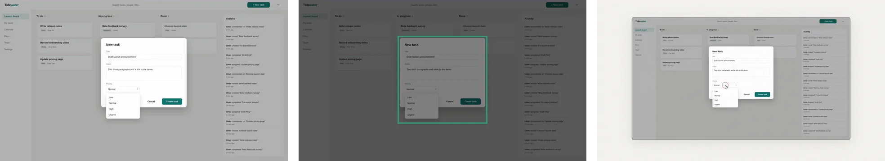

<h1 align="center">
   takeone
</h1>

<p align="center">
  <strong>Record once. Direct the camera afterwards.</strong><br/>
  Turn a raw screen recording into a framed, paced demo video, on your own machine.<br/>
  <a href="https://github.com/umeranjum17/takeone/actions/workflows/ci.yml"></a>
  
  
</p>

<p align="center">
  <picture>
    <source media="(prefers-color-scheme: dark)" srcset="docs/assets/readme/hero-dark.webp" />
    <source media="(prefers-color-scheme: light)" srcset="docs/assets/readme/hero-light.webp" />
    
  </picture>
</p>

<p align="center"><sub>A fresh takeone render of the demo board, on the <code>paper</code> theme in light mode and <code>midnight</code> in dark mode.</sub></p>

## Why takeone

A good demo needs camera work: show every click, hold the dialog you type into, pull back when the result lands.
Doing that while you demo means performing and directing at the same time.

takeone splits the two jobs. You record the way you normally use your app.
takeone plans the shots afterwards from what actually happened on screen, then renders the video locally.

## How it works

<p align="center">
  <picture>
    <source media="(prefers-color-scheme: dark)" srcset="docs/assets/readme/journey-dark.webp" />
    <source media="(prefers-color-scheme: light)" srcset="docs/assets/readme/journey-light.webp" />
    
  </picture>
</p>

1. **Record** the whole screen, plus your clicks and key types. The characters you type are never recorded.
2. **Plan** the camera: takeone splits the take into moments and finds what you acted on (the green box).
3. **Render** a framed, paced MP4 on a themed stage, with click rings, a crisp cursor and captions.

## Quick start

You need [Node.js](https://nodejs.org/) 22.19 or newer and [ffmpeg](https://ffmpeg.org/) on your PATH.

```sh
git clone https://github.com/umeranjum17/takeone && cd takeone
npm install
node scripts/synth-take.ts tmp/synth-demo && node bin/takeone.mjs make "$PWD/tmp/synth-demo" --no-jev
```

Your video is at `tmp/synth-demo/out/synth-demo.mp4`. The demo take is generated, so you need no screen recorder or API key, and planning runs offline.
To record your own screen, a phone or the iOS Simulator, follow the [guide](docs/guide.md#quickstart).

## Features

- **Records your real workflow.** The desktop on Linux (Wayland and Hyprland), an Android phone or emulator, or the iOS Simulator.
- **Plans the camera after you record.** From your clicks, typing and what changed on screen.
- **Keeps the action readable.** Click rings, a drawn vector cursor and keycaps for shortcuts like `Ctrl+S`.
- **Looks finished out of the box.** A rounded screen card on a stage, in six themes from dark `midnight` to cream `paper`.
- **Titles and captions.** Set in a band below the screen, never over your app.
- **Paces itself.** Idle stretches play faster, typing can too, and spotlight and blur boxes follow the content.
- **Private and cheap.** Works fully offline with `--no-jev`; with the Jev planner, about $0.0006 per minute of video.
- **Exports what you need.** MP4 by default, plus GIF, WebM and ProRes 4444, landscape, portrait or square.
- **Motion films from screens.** `takeone motion` turns screenshots, HTML or a URL into a short film.

## Learn more

- [Guide](docs/guide.md): install, the full quickstart, planning and rendering
- [Recording](docs/recording.md): desktop, phone and Simulator capture, commands and take files
- [Look and pacing](docs/look.md): themes, stage, zoom, captions and every look setting
- [Edit controls](docs/edit-controls.md): output size and format, hold-style camera, speed regions
- [Overlays](docs/overlays.md): spotlight and blur regions, shortcut keycaps
- [Motion films](docs/motion.md): films from screenshots, HTML or a URL
- [Cost](docs/cost.md): measured planner cost per minute and its hard caps
- [Demo scene](docs/headless-scene.md): reproduce the board demo shown above

## Development

```sh
npm install
npm test
```

Questions and bugs go to [GitHub issues](https://github.com/umeranjum17/takeone/issues).
